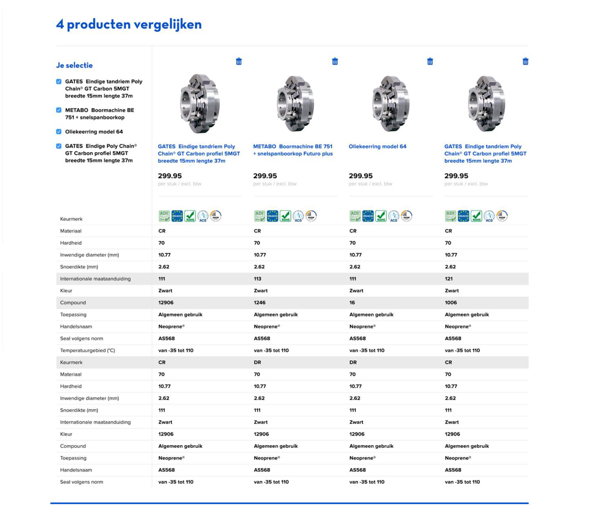
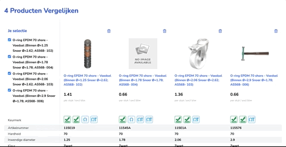
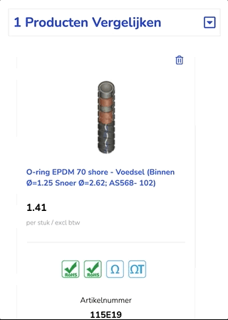

# NextJS + TailwindCSS + Styled Components Demo

Simple showcase on how to use NextJS with Tailwind and Styled Components.

**Provided design of the page to be crafted**



## How is the solution looking like?

**Desktop:**



**Mobile:**



## Getting Started

First, install all the dependencies:
```bash
yarn install
```

Then, build all the stuff to have pre-rendered static resources to have a production version to check:
```bash
yarn run build
```
then
```bash
yarn start
```

To bring the project up and running for development mode, go to de **react-app** folder and
```bash
yarn run dev
```

To run the tests:
```bash
yarn run test
```


## Briefing

Here are some important assumptions made to guide the design and some decisions of the project:
1. Let's consider that the UI/UX provided by the briefing should be followed with no - or minor - modifications. So, for instance, the more tabular design style used in the design yields us to use a `<table/>` instead of `<Card/>`. If the exercise asked for some alternatives on how to build this Product comparision page, maybe we could have some options using `<Card>`, `<div>` and other things, but that's not the case. So, most decisions here will be guided towards making the provided design - and spec - with the most fidelity as possible.
1. We rely on good practices of componentization, modularization, SOC, etc, but having the scope of the project in sight to not over-engineering things.
1. Despite the spec presents just a Product Page, let's consider that this is just part of a medium project and let's build/use a Design System as it was given. That's why it will be built in the "lib" folder, to emulate as if those components were provided by a separated module

We are advancing on test coverage, but currently we are aiming to have tests for all different parts of the application, like design system components, pages and hooks. Currently we have for the design system components and for the hooks that deal with business logic


## Some Decisions and important information:

Here's a summary of some decisions made: 
1. Use a Design System: see [About Design System]() section
1. Build the Design System using another battle-tested Design System - [TailwindCSS](https://tailwindcss.com/docs) - combined with [styled-components](https://styled-components.com/)
1. Unit test the Design System elementary (element) components just to prevent they don't have positioning and spacing styles and as a kind of "TDD for design" in which we expect on the test some tokens to be present base on the Mock overview
1. Unit test the more complex components to ease the business rules requirements implementation and provide backwards constraint in refactors and evolutions.
1. As the interactions are somewhat simple and don't take state change propagation/notification to many levels, we are handling all business logic state and actions using Hooks and Effects at the main component (`<ProductCompare />` in compare/index.js) and not using orther third party solutions like Redux, Mobx, Apollo GraphQL and other options out there.
1. We have a route named `ui-ux` (menu UI/UX) that represents the first step "chopping" the provided design into a pure HTML/CSS Design System page. see [From Mock to Components Pipeline]() section


### About Design System

When you have a Design System, it becomes faster to build new pages and components, but building and evolving a Design System is a interesting tough job. In this exercise I tried to simulate like if we already had a Design System for Desktop resolutions but not for mobile and we were working on that.
- The first thing to notice about this exercise is that when you don't have a Design System fully defined yet it is a good idea to start defining it with the good old CSS. After implementing and validating this Design System, we can go to the good and fancy styled-components, because the people working in the Design System definition and tokens does not necessarily knows styled-components and the Design System doesn't need to be used only by React applications. Honestly, a Design Systema needs first to be written in pure CSS to be available to any HTML/CSS technology.
- The second lesson here is that it is a good ideia to start with a consolidated Design System as a base. I chose Tailwind for the following reasons:
    - Awesome aesthic out of the box, with balanced colors, shades, font size proportion, space proportion and so on
    - Great granularity and options of styling and allowing us to build our Design System on top of that
    - Optimizations on the build process that makes the embedded css contain only the used classes among the project, reducing a lot the bundle size (CSS part)
    - Good and solid documentation
    - Awesome community support and adoption
    - Easy for HTML5/CSS developers that might not have fluency with React to colaborate
- When having a Design System, the user have this smooth transition between evolving pages and components. For instance, if you check the Desktop and the Mobile page you will see that they have some differences, because it was like the Desktop page is using a v1.1.0 of the Design System and the mobile is using a v1.3.0
- The mobile doesn't have a Design System and don't have styled-components yet because it is simulating as if it was on the validation/maturation phase
- In the Design System components we should avoid putting attributes that affects positioning of the elements. That's why I implemented unit tests for those components that assure they don't have thouse kind of attributes (like margin, float, etc)

### TailwindCSS vs Styled-Components? Not really..

I tried in this approach to use a module named `tailwind-styled-components` which helps us to build styled-components but with Tailwind tokens. We can check whether we could improve it by inspecting TailwindCSS tokens and building the native styled-components with those values.
I think we have space for both Tailwind and Styled-Compoents in the project. Styled-components is a great choice for the components of your Design System that are already consolidated and battle-teste. Its more a scale thing. Tailwind is great to fill the gaps you may have on your Styled-Components empowered Design System and to try new things to evolve your Design System that you will eventually discard on the process.

### Responsiviness and Mobile

When dealing with responsive design we must decide whether the mobile interaction can be done just with some `@media queries` and minor adaptations in the structure that serves the Desktop version or if we need a separate structure (component) for the mobile experience. In this case, I chose to build a new structure for the Mobile, but yet, using some of the Design System components. That what made the mobile design and experience a bit difference, but very acquainted.
PS - Just remembering the rule of thumb: if you are presenting something new to the user, try to make it familiar. If you are presenting something that is legacy, bring some little news to it. Design System helps a lot with this.

### From Mock to Components Pipeline

The process of implementation had the following steps:
1. Check the provided design/mockup to outline the scope
1. Start building a page using just HTML/CSS, preferring to use our Design System tokens (in case, Tailwind)
1. Based on this HTML/CSS page, map structures that repeats, colors used, font size and so on. 
1. With this map in hand, start the React componentization with Styled-Components and Composite components.
1. In the process of creating those components use unit test to work faster and to guarantee backward compatibility during the evolution of the components, and to define a little the behavior of the components
1. After this first round of componentization, start to build the React powered page, filling the gaps with new components if necessary or event then with CSS Design System tokens (Tailwind CSS classes)
1. After getting the components done and the look and feel of the page just like what we were looking for, start dealing with business logic
1. Evaluate whether the business logic is complex or simple, if involves state and data propagation and flow, deep propagation and flow. If that's the case, choose a state management solution. If not, go with in-component logic or with Hooks.
    - I decied to create a Hook to handle the business logic because it wasn't that complex and could be very isolated with just one Hook
    - This Hook is used by both Desktop and Mobile component with no modifications
    - The mobile needed to handle some transformation on the data. That's something to think about and improve.

## A few words about NextJS

### Where is the root Component?

NextJS is React. So pretty much you will follow the same React path from component to component. But there are some tips to get started:
1. The top most (root) component of the application is defined in `pages/_app.js`. In some scenarios you don't even need to provide it as you could use the bult-in `next/App`. But in our case we are overriding this because we are importing the **tailwind.css** there to be globally available.
1. The `pages/index.js` is the "/" component, so in terms of day-by-day development, we can consider this as the root of the application


### Special NextJS Files

- _app.js
- _document.js

### Router

Router is provided out of the box by React Router. The convention is that the path of the route is the folder name under the **pages** folder.


## Caching

In the hook logic we use a tiny simple cache solution, called **"simple.cache"**.
As we need something really simple, simple.cache was a great discovery, having just 5kb of size. Just for the sake of comparasion, node-cache has 55kb.


## Dependencies

This project has two big dependencies: NextJS and Tailwind. But the have a robust tooling that handles the running and building/packaging job, with minor adjustments.
Besides those two, we have:
- **styled-components** for building our Design System and other components in React
- **@fortawesome** for this icons
- **simple.cache** for caching fetch requests and avoid request rush between Desktop and Mobile component. This is a really tiny (5kb) and stable module.
- We have dev dependencies for testing, mocking fetch and rendering React components